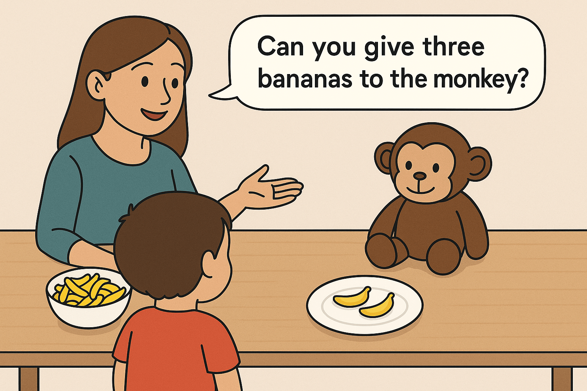
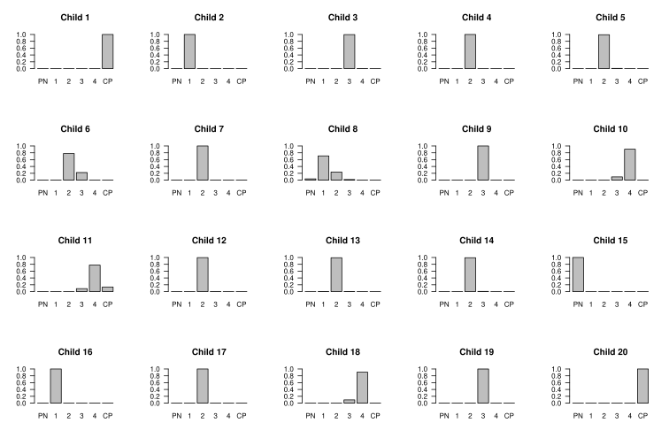
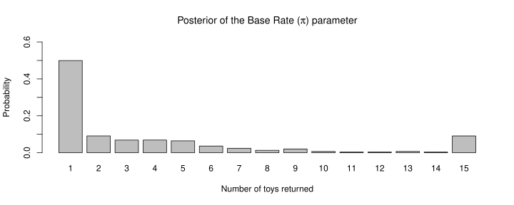
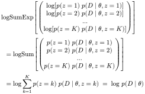
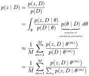

Advanced quantitative methods are very difficult for many students (including me). Besides their inherent mathematical complexity, the major obstacle impeding understanding of these methods, I suspect, is that, in education, they are often treated as techniques *decoupled from* a field's substantive knowledge. This makes teaching (seemingly) efficient, but at best can only bring students so far to carry out *standardized quantitative analyses* that are valid only in a fixed and small set of situations, which is quite frustrating to be honest. On the other hand, when one is capable of seeing how substantive knowledge manifests itself in a statistical model, things start to make sense, and data analysis can become very addictive. 

In this post, I will introduce *marginalization*---a technique often arising in Bayesian computation to deal with discrete model parameters---*within* a substantive context from a cognitive modeling example. Along the way, the mathematics of marginalization will inevitably be presented (nothing beyond the Stan manual on [latent discrete parameters](https://mc-stan.org/docs/stan-users-guide/latent-discrete.html)), but with detailed explanations. Some patience and the substantive context will hopefully clear out the technical challeges standing in the way. This is not a beginner's level introduction though, and I highly recommend Prof. McElreath's [pedagogically genius material](https://elevanth.org/blog/2018/01/29/algebra-and-missingness) on coding discrete parameter models in Stan. It's the best resource I am aware of to get started with the marginalization technique, and it's also the basis on which the current post builds upon.

Before diving into marginalization, let's start with the substantive context.


## What's in a number?

Developmental psychologists have long been interested in children's number concept development. To study children's numerical cognition, psychologists need some way to gauge whether a child *understands* certain numbers, and this is by no means easy. Being able to recite from one to ten *does not* indicate that a boy understands the *cardinal meaning* of these ten numbers---he might be simply reciting the numbers in orders *without* knowing that each number corresponds to a particular *quantity*. In general, measuring understanding, and indeed, *all* psychological variables, is challenging in itself, as psychological states and processes are inherently **unobservable**. So the best one can do is to *infer* these latent quantities through **observable behavioral data**. However, this is only possible if we have a well-articulated theory such that a detailed data generative process mapping the unobservables to the observed can be specified.

Therefore, to measure children's understanding of numbers, a theory of number concept learning and representation, and a model that formalizes this theory and the behavioral task, are necessary. Lee & Sarnecka (2010, 2011; see also Chap. 19 of Lee & Wagenmakers (2013)) present such a model, in which the full data generative process of the Give-*N* task, the canonical task for measuring number understanding in children, is articulated, thereby making it possible to infer children's understanding of numbers from behavioral data.

To gain an intuitive sense of how number understanding can be measured, let's first take a look at the Give-*N* task, as illustrated in the figure below. In each trial of a Give-*N* task, the experimenter asks the child to give some number of toys to a doll (e.g., '*Can you give three toy bananas to the monkey?*'), and the child responds by selecting some number of toys from a bowl and returning them to the doll. Over multiple trials, the Give-*N* data is then simply a series of question-answer pairs where the questions are the numbers requested by the experimenter, and the answers are the quantities returned by the child. A child's **knower level**, according to the conventional scoring of the Give-*N* task, is defined as the *highest* number for which a child can *accurately* return the correct number of toys (e.g., in two out of three 'one' trials), and that the child does not return that same number for any other numbers asked. Put it another way, the scoring rule is implicitly defining *understanding of a particular number* as:

1. The child always returns the correct number of toys when prompted.
2. The child does not mistake that number for any other quantities.



Simple and intuitive as it may seem, in practice, the Give-*N* task has many different setups across studies (e.g., number of trials per number requested, definitions for *accurately* returning of correct numbers, task specifics like the number of toys in the bowl, etc.). Considering this and the noisy nature of behavioral data, the knower level as derived from conventional scoring procedures is thus unavoidably a mixture of the true knower level and other task-specific quirks. To *cleanly* measure knower levels, a model of the Give-*N* task is *necessary*.

A model of the Give-*N* task
----------------------------

$$
\begin{aligned}
    a_{ij} &\sim \text{Categorical}(\boldsymbol{\pi^\prime_{ij}}) \\
    \pi^\prime_{ijk}   &\propto 
                    \begin{cases} 
                        \pi_k & \text{if } k > z_i \\ 
                        v \times \pi_{k} & \text{if } k \leq z_i \text{ and } k = q_{ij} \\
                        \frac{1}{v} \times \pi_{k} & \text{if } k \leq z_i \text{ and } k \ne q_{ij}
                    \end{cases} \\
    z_i          & \sim    \text{Categorical}(\frac{1}{6}, \frac{1}{6}, ..., \frac{1}{6}) \\
    v            & \sim    \text{Uniform}(1, 1000) \\
    \begin{bmatrix} 
        \pi_1 \\ \pi_2 \\ \vdots \\ \pi_{15}
    \end{bmatrix}
                 & \sim    \text{Dirichlet}( \overbrace{1,1,...,1}^{15} )
\end{aligned}
$$

The model above formalizes the full Give-*N* task described verbally in the previous section. It looks intimidating at first glance, but let's stay tuned and break it down:

1. $a_{ij}$ is the answer (i.e., the number returned) from child $i$ responding to the $j$ th question $q_{ij}$ (the number requested). As the number of toys returned is physically constrained by the number of toys in the bowl, here we model $a_{ij}$ as a number (1~15) drawn from a categorical distribution, where the parameter $\boldsymbol{\pi^\prime_{ij}}$ specifies the probability for each of the 15 numbers being drawn.

2. $\boldsymbol{\pi^\prime_{ij}}$ is a simplex (i.e., a vector of probabilities summing to 1) parameterizing the categorical distribution above. $\boldsymbol{\pi^\prime_{ij}}$ has 15 elements as there are 15 toys in the bowl in the Give-*N* task here. Each element $\pi_{ijk}^\prime$ in $\boldsymbol{\pi^\prime_{ij}}$ corresponds to the probability of the number  $k$ being returned (e.g., the value of the fifth element, $\pi^\prime_{i,j,5}$, is the probability that 5 is being returned). This line of the model shows how $\pi^\prime_{ijk}$ (the probability of a number $k$ being returned after number $q_{ij}$ was requested) derives from the base rate probability, $\pi_k$, of returning number $k$:

    1. If child $i$ **does not** understand the number word $k$ (i.e., $k \gt z_i$, where $z_i$ is child $i$'s knower level), $\pi^\prime_{ijk}$ stays the same (before normalization).
    2. If child $i$ **understands** the number word $k$ (i.e., $k \leq z_i$), then the probability of returning $k$ becomes greater by a factor of $v$ if $k$ is also the requested number $q_{ij}$. Otherwise, the child would know *not to* return $k$, and this is modeled by decreasing $\pi_k$ by a factor of $\frac{1}{v}$ ($v$ is constrained to be greater than 1).
    3. After calculating the updated values with the rules above, the vector is normalized to sum to one so that $\boldsymbol{\pi^\prime_{ij}}$ remains a simplex.

3. The remaining lines specify the prior distributions of the model's parameters.

    $z_i$ is child $i$'s knower level, which is a latent discrete parameter that has six potential states, each assigned with an equal prior probability of $\frac{1}{6}$: 
    
     - $z_i = 1$: PN-knower (Pre-Number knower, i.e., does not understand any numbers)
     - $z_i = 2$: One-knower
     - $z_i = 3$: Two-knower
     - $z_i = 4$: Three-knower
     - $z_i = 5$: Four-knower
     - $z_i = 6$: CP-knower (Cardinality-Principle knower, i.e., understands the cardinal meaning of all numbers). 
  
    This division of the knower levels is based on the knower-level theory developed in previous literature, which we have no space to explain in detail. In brief, the knower-level theory posits that children learn the cardinal meaning of the number words sequentially, and in order, up to the number word *four* (or *three*), after which the children grasp the cardinality principle, which is the rule that the ordinal positions of the number words correspond to their quantities. Therefore, after understanding this, the children will be able to apply the cardinality principle to all numbers that they can count up to to derive the numbers' cardinal meanings, thereby, truely acquire the ability to *understand quantities through counting*. 

    $v$ controls the magnitude of how $\pi_k$ updates to $\pi^\prime_{ijk}$ when a child understands the number word $k$. It is conveniently modeled as a Uniform distribution bounded between $1$ and $1000$. This upper bound of $1000$ is arbitrary---a large enough value is specified to bound $v$ within a sensible range, since the magnitude of the update (in terms of an increasing/decreasing factor) is expected to be quite large if the child truly understands the number word $k$.

    Finally, the base rate distribution of returning a number, $\boldsymbol{\pi} = \begin{bmatrix} \pi_1 ~ \pi_2 ~ \dots ~ \pi_{15} \end{bmatrix}^T$, is modeled as a Dirichlet prior with all parameters set to one. This parameter setting corresponds to cases where all potential instances of $(\pi_1, ~ \pi_2, ~ \dots, ~ \pi_{15})$ has equal probability of occurrence, and therefore provides no prior preference for drawing certain values from the base rate distribution.
    
    Intuitively, the base rate distribution could be thought of as the children's baseline tendency in returning certain numbers. For instance, children in general may default to returning 'one' or 'all' (15 in the case here) toys, when they fail to understand the question. The base rate parameter in the model allows us to capture this aspect of the baseline tendency presented in the Give-*N* data.

The logic of marginalizing out and recovering the discrete parameter
--------------------------------------------------------------------

In my own experience, the greatest confusion revolving around models with discrete parameters does not arise from marginalization per se, but from the *recovery* of the marginalized-out discrete parameters from the rest of the posterior. Some algebra is required to scaffold the understanding of these, but before bombarding the reader with mathematics, I think it will be much easier if we start with the implementation. So let's turn the model of the Give-*N* task above into Stan code. I'll begin with a general recipe for coding models with discrete parameters in Stan, along which I also sneek in a little bit of math:

1. Specify the **continuous** parameters in the `parameters` block.

2. In the `transformed parameters` block, create a variable `logM` to hold the (logged) marginalized likelihood, or, to put it more precisely, the likelihood with the discrete parameter marginalized out. Of utmost importance is `logM`'s data structure, where several slots are created to each hold the product of the likelihood *under a specific state* of the discrete parameter and the probability of that state: $p(z=k) ~ p(D \mid \theta, z=k)$. Here, $z$ refers to a discrete parameter, $\theta$ a continuous one, $D$ the data, and $k$ a specific state of $z$. We can do this because the full marginalization can be written as:
$$
\begin{aligned}
p(D \mid \theta) & = \sum_{k=1}^K p(z=k, D \mid \theta) \\
                & = \sum_{k=1}^K p(z=k) ~ p(D \mid \theta, z=k)
\end{aligned}
$$

   So we are putting the intermediate terms (i.e., terms under specific states of $z$ yet to be summed together) of the marginalization into the `logM` variable. This will help us recover the discrete parameter $z$, as we shall see later.

3. In the `model` block, we update the posterior by summing together the product under each state and adding them to the posterior, ususally with the code `target += log_sum_exp(terms in logM)`. The `log_sum_exp()` function is just a handy and numerically stable way to do the summation on the log scale[^log_sum_exp].

4. Finally, in the `generated quantities` block, we again use the terms held in `logM` to recover the posterior of the discrete parameter $z$. The probability of a state $s$ in $z$ can be approximated and computed from the posterior samples of the continuous parameter $\theta$:
$$
\begin{aligned}
p(z=s \mid D) &= \frac{1}{M} \sum_{m=1}^M \frac{p(z=s, D \mid \theta^{(m)})}{p(D \mid \theta^{(m)})} \\
              &= \frac{1}{M} \sum_{m=1}^M \frac{p(z=s, D \mid \theta^{(m)})}{
                \sum_{z} p(z, D \mid \theta^{(m)})
            }
\end{aligned}
$$

    , where $m$ indicates the $m$ th posterior sample of $\theta$, and $M$ is the total number of posterior samples drawn. The derivation of this formula is provided at [the end of the post][ref-appendix].
    
    As can be seen from $\frac{p(z=s, D \mid \theta^{(m)})}{\sum_{z} p(z, D \mid \theta^{(m)})}$, the numerator corresponds to one of the individual terms in `logM`, and the denominator corresponds to the sum of all individual terms. Therefore, we can easily recover the posterior of $z$ just from the terms in `logM`. A handy way to compute this is through the `softmax()` function, which is defined as:

    $$
    \text{softmax}(\begin{bmatrix} x_1 \\ x_2 \\ \vdots \\ x_n \end{bmatrix}) = 
    \begin{bmatrix} e^{x_1}/S \\ e^{x_2}/S \\ \vdots \\ e^{x_n}/S \end{bmatrix}
    \text{, where } S = \sum_{i=1}^{n} e^{x_i}
    $$
    
    Remember that the terms in `logM` are on the log scale, so we can simply pass them to `softmax()` to obtain $p(z \mid D)$ directly.

The recipe above leaves out details of the code implementation, but should be enough to guide the reader through implementing most discrete parameter models in Stan. Now, let's proceed to the Stan code.

[ref-appendix]: #appendix-the-mathematics-of-recovering-z 

Coding the knower-level model in Stan
-------------------------------------

### The Give-*N* data

The Give-*N* data here can be found in the associated code of [Bayesian Cognitive Modeling](https://bayesmodels.com) (Lee & Wagenmakers, 2013). I preprocessed the data (`fc_given.mat`) into [JSON](https://github.com/liao961120/knower-levels/blob/main/made/data.json) for easy access in other languages.

In the Stan model, we need only these variables below from the Give-*N* data, as shown in the `data` block:

``` stan
data {
    int nt;  // max num of trials for each child
    int ns;  // num of children
    int nz;  // num of knower levels (1: PN, 2: one, 3: two, 4: three, 5: four, 6: CP)
    int gn;  // num of categories (i.e., num of toys in the bowl)
    array[ns, nt] int gq;  // question matrix (0: missing value)
    array[ns, nt] int ga;  // answer matrix (0: missing value)
}
```

The meanings of these variables should be clear from the trailing comments, but some variables require further explanation. First note that `nt` is not presented in the Give-*N* data and is defined here to make coding simpler. Specifically, `nt` is defined as the maximum number of trials across all children, which is `21` in this case. This helps initiating `gq` and `ga`, the most important variables in the Give-*N* data. Each row of `gq` records the questions (the requested numbers) asked of a particular child, and the corresponding row in `ga` records the answers (the returned numbers) from the same child. If the total number of trials for a child is less than `nt`, then the remaining entries in `gq` and `ga` are coded as `0`. 

### Parameters and marginalized likelihood

In Stan, we define model parameters in the `parameters` block, but only for continuous ones. When working with discrete parameters, we need special treatments, such as a `logM` variable defined in the `transformed parameters` block to hold the intermediate terms during marginalization, as described in the recipe above.

In our Give-*N* model here, we simply place the continuous parameters as usual in the `parameters` block: 

``` stan
parameters {
    simplex[gn] Pi;               // base rate preference
    real<lower=1, upper=1000> v;  // evidence value
}
```

We can then define `logM` in the `transformed parameters` block, as `logM` depends directly on the contiuous parameters. When working with `logM` in the `transformed parameters` block, we are essentially dealing with the core model logic (as it is the likelihood). Thus, complex models often result in very long code in the `transformed parameters` block. Let's first look at the data structure of `logM` for our model:

``` stan
transformed parameters {
    array[ns] vector[nz] logM;
    /* Omitted code ... */
}
```

`logM` in the case here has to hold, separately for each child, the unaggregated marginalized likelihood terms. Therefore, the first dimension of `logM` indexes the children, and the second dimension indexes the unaggregated marginalized terms. For instance, there are 6 (i.e., `nz`) terms of $p(z_i) ~ p(D_i=ga_{i\cdot} \mid z_i, \theta=(\pi, v))$ for child $i$ saved in `logM[i,]`, each of which corresponds to one of the six possible states of $z_i$. Later in the `model` block, we aggregate these terms with `log_sum_exp(logM[i,])` to compute the posterior distribution. 

The real challenge here to understand the implementation though, lies in the temporary term `piprime`, which is created for aiding the calculation of the unaggregated terms in `logM`. `piprime` corresponds to 
$\boldsymbol{\pi}^\prime_{ij}$
in the model formulation above, but for ease of tracking the logic of the code, we structure `piprime` such that all possible values of 
$\boldsymbol{\pi}^\prime_{ij}$
are saved in and indexed by their corresponding positions. 

$\boldsymbol{\pi}^\prime_{ij}$, which is the updated base rate probabilites of returning certain numbers, depends on two factors: (1) the knower level of child $i$ ($z_i$) and (2) the question $j$ asked of child $i$ ($gq_{ij}$). Since $\boldsymbol{\pi}^\prime_{ij}$ is a simplex (i.e., given the knower level $z_i$ and a question $gq_{ij}$, $\boldsymbol{\pi}^\prime_{ij}$ is a 15-dimensional discrete distribution that sums to one), `piprime` is initiated as a 2 dimensional array where each entry in the array is a 15-dimensional simplex: `array[nz, gn] vector[gn] piprime`. For example, say we requested *four* toys ($gq_{ij} = 4$) from a *two-knower* ($z_i=3$), then we can compute $\boldsymbol{\pi^\prime}$ for this case and save the resulting distribution (i.e., the probabilities of returing 1~15) under `piprime[3,4,1:15]`. The code below initiates and fills in all the entries in `piprime` according to the model formulation. 

``` stan
transformed parameters {
    /* Omitted code ... */

    array[nz, gn] vector[gn] piprime;
    for (z in 1:nz) {
        for (q in 1:gn) {
            for (k in 1:gn) {
                // k > z (doesn't understand)
                if (!understands(z, k))
                    piprime[z,q,k] = Pi[k];
                // k <= z (understands)
                else {
                    if (q == k)
                        piprime[z,q,k] = Pi[k] * v;
                    else
                        piprime[z,q,k] = Pi[k] / v;
                }
            }
            // Normalize piprime
            piprime[z,q,] = piprime[z,q,] / sum(piprime[z,q,]);
        }
    
    /* Omitted code ... */
}
```

From the code above, we can see that the three-layer for loop first loops through all possible knower levels ($z$), then loops through all possible questions, and finally loops through all possible returning numbers. The conditionals inside the loop specify the logic to fill up the entries in `piprime`. Crucially, the values in `piprime` depend on what `understands(z, k)`[^src-code] returns, which is `1` (true) when a child of knower level `z` understands the number `k` and is `0` (false) otherwise. Finally, before ending this three-layer loop, `piprime` is normalized to sum to one.

[^src-code]: The implementation of `understands()` can be found in the [full model code](https://github.com/liao961120/knower-levels/blob/main/src/m2.stan).

Now that we have `piprime`, we can proceed to fill up `logM`. The data structure of `logM` retains the subject-level information (i.e., each child's information is saved separately, as indexed by the first dimension of `logM`), but aggregates information across trials within each child in each `logM[i,z]` entry. Since in our model, within-subject trials are assumed to be independent given a child's knower level $z_i$, the log likelihood terms in the code, `categorical_lpmf(a | piprime[z,q,])`, are simply added (i.e., multiplied on the probability scale) together across the trials in the deepest layer of the for loop. In addition to the log likelihood terms `categorical_lpmf(a | piprime[z,q,])`, we also need the (log) prior for the knower level $p(z_i)$, which is assigned an equal probability of $\frac{1}{6}$ (or `1/nz`) for all knower-level states. In code, this is implemented as `logM[i,z] = log(1.0/nz)`, before the log likelihood terms are added to `logM[i,z]`.

``` stan
transformed parameters {
    /* Omitted code ... */

    for (i in 1:ns) {
        for (z in 1:nz) {
            logM[i,z] = log(1.0/nz);  // Prior of knower level
            // Independent trials (question-answer pairs)
            for (j in 1:nt) {
                int q = gq[i,j];
                int a = ga[i,j];
                // Missing value (does not add information)
                if (q == 0)
                    logM[i,z] += 0;
                else
                    logM[i,z] += categorical_lpmf(a | piprime[z,q,]);
            }
        }
    }

    /* Omitted code ... */
}
```


### Model fitting

After doing most of the hard work in the `transformed parameters` block, not much is left for the `model` block:

``` stan
model {
    Pi ~ dirichlet(rep_vector(1,gn));
    v ~ uniform(1, 1000);
    for (i in 1:ns) {
        target += log_sum_exp(logM[i,]);
    }
}
```

Three things remain to be done to fit the model: 

1. Specify the priors for the continuous parameters.
2. Aggregate the terms in `logM[i,]` with `log_sum_exp()` to obtain the marginalized log likelihood $\text{log } p(D_i=ga_{i\cdot} \mid \theta=(\pi, v))$ for each child.
3. Aggregate the information across children to update the posterior. Since the data from different children are assumed to be independent, this can simply be done through a for loop, incrementing the log posterior density by `log_sum_exp(logM[i,])`.

### Recovering the discrete parameter

We have worked out the [logic of recovering the discrete parameters][sec-ref] previously. Now let's implement this logic in code. Remember that we are trying to recover the latent knower level for *each* child. Therefore, we initialize `Pz`, an array of simplexes, to hold the results for each child. We then loop through the children and recover the probability mass function (PMF) of $z_i$ for each child:

``` stan
generated quantities {
    array[ns] vector[nz] Pz;  // Probability mass function of z (posterior of z)
    for (i in 1:ns) {
        Pz[i] = softmax(logM[i,]);
    }
}
```

The figure below plots the recovered PMFs of $z_i$ for all 20 children in the Give-*N* data. Careful readers may spot that the results differ slightly (e.g., take a close look at child 8) from those presented in Bayesian Cognitive Modeling (Figure 19.3 on p. 241). This is because in the authors' WinBUGS implementation of the knower-level model, a set of 15 independent uniform Beta priors (refer to the code on p.240), instead of a single 15-dimensional Dirichlet prior, was used to model the base rate parameter $\boldsymbol{\pi}$. The Stan implementation here (using the Dirichlet prior) follows the original model formulation as presented above and on p. 238 in Bayesian Cognitive Modeling.



<!--  -->

Further Resources
-----------------

Albeit the details, the current post is probably still hard to read. To fully appreciate the development of the knower-level model, please refer to the excellent chapter (Lee & Wagenmakers, 2013) and papers (Lee & Sarnecka, 2010, 2011) by the original authors.

Martin Smira's [Stan translation](https://github.com/stan-dev/example-models/blob/master/Bayesian_Cognitive_Modeling/CaseStudies/NumberConcepts/NumberConcept_1_Stan.R) of Lee & Wagenmakers (2013)'s WinBUGS code provided the foundation to build up and test against the model implementation here. 

All related code and data for the current post is found at [github.com/liao961120/knower-levels](https://github.com/liao961120/knower-levels).


References
----------

- Lee, M. D., & Sarnecka, B. W. (2010). A Model of Knower-Level Behavior in Number-Concept Development. Cognitive Science, 34(1), 51–67. https://doi.org/10.1111/j.1551-6709.2009.01063.x
- Lee, M. D., & Sarnecka, B. W. (2011). Number-knower levels in young children: Insights from Bayesian modeling. Cognition, 120(3), 391–402. https://doi.org/10.1016/j.cognition.2010.10.003
- Lee, M. D., & Wagenmakers, E.-J. (2013). Bayesian cognitive modeling: A practical course. (pp. xiii, 264). Cambridge University Press. https://doi.org/10.1017/CBO9781139087759


[sec-ref]: #the-logic-of-marginalizing-out-and-recovering-the-discrete-parameter

[^log_sum_exp]: `log_sum_exp()` takes in a vector, exponentiates each term in the vector, sums them together, and then takes the log of the sum. This is quite often used in statistical computation because we prefer to express probabilities on the log scale for numerical stability. Let's use the marginalization formula to illustrate `log_sum_exp()`. Suppose we already have each product term on the log scale: $log( p(z) p(D \mid \theta, z) )$, and we want $log ~ p(D \mid \theta)$, `log_sum_exp()` gives us:
    
    <div style="overflow-x:scroll; width:100%"></div>


Appendix: The mathematics of recovering $z$
-------------------------------------------

To show that 
$p(z=s \mid D) = \frac{1}{M} \sum_{m=1}^M \frac{p(z=s, D \mid\theta^{(m)})}{p(D \mid \theta^{(m)})}$, 
let's first start with $p(z, D)$.

$$
\begin{aligned}
p(z,D) & = \int_{\theta}p(z,D,\theta)d\theta \\
 & = \int_{\theta}p(\theta)p(z,D \mid \theta)d\theta \\
 & = \int_{\theta}\frac{p(\theta \mid D)}{p(\theta \mid D)}p(\theta)p(z,D \mid \theta)d\theta \\
 & = \int_{\theta}p(\theta \mid D)\frac{p(D)}{p(D \mid \theta)}p(z,D \mid \theta)d\theta\quad\left( \because\frac{p(\theta)}{p(\theta \mid D)} = \frac{p(D)}{p(D \mid \theta)} \right) \\
 & = p(D)\int_{\theta}\frac{p(z,D \mid \theta)}{p(D \mid \theta)}p(\theta \mid D)d\theta
\end{aligned}
$$

Since the posterior of $z$, $p(z \mid D) = \frac{p(z, D)}{p(D)}$, we have:



As the integrand 
$\frac{p(z,D \mid \theta)}{p(D \mid \theta)} p(\theta \mid D)$ 
includes 
$p(\theta \mid D)$, the posterior of the continuous parameter, we can think of $p(\theta \mid D)$ as weighing its preceeding ratio, according to the posterior distribution of $\theta$. Thus, computationally, when we draw posterior samples of $\theta$ and then compute the ratio $\frac{p(z,D \mid \theta)}{p(D \mid \theta)}$ based on these $\theta$ samples, we are essentially approximating this weighing of the ratio with $p(\theta \mid D)$ in the integral.
